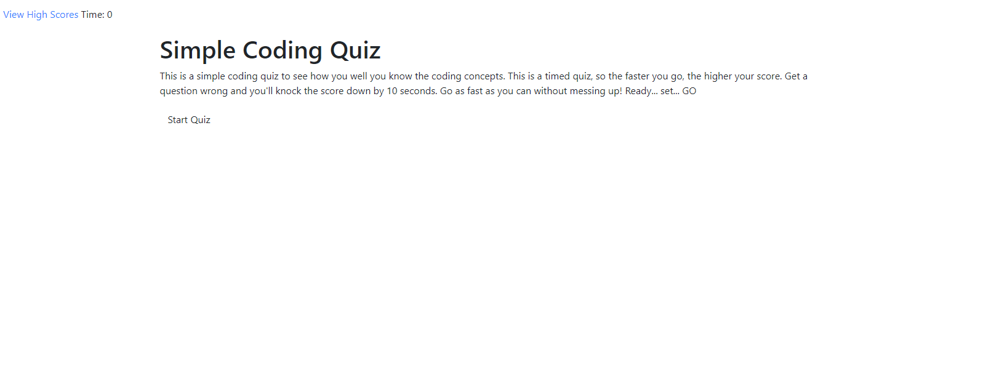

# 4 homeworkQuiz

The purpose of this homework was to create a quiz with a timer. If the quiz taker were to get a question wrong, then the time would deduct more time off the timer. Then, when the quiz is done, the final score is the time that's left. Which then must the quiz taker must be able to put in their name and there is a record of it. 

## Prerequisites

```
Used Visual Studio Code and chrome's inspector tool to help build and rework code. Also used Bootstrap to help with the HTML and CSS for styling.
```

## Process/What was Changed

```
The first set was to create my HTML and get a basic framework of what my quiz would be. Hiding elements until they were trigger by a click event and make sure a timer would show. Once the user clicks Start Button, it unhides my quiz elements and the timer started. 

Next was making sure the right list of questions and answer selections show so I had to make an object array and getelements to find those in the array and display them correctly. Also had to make sure there was a set attribute for all the answers. And make sure there were event listener for all the correct options. 

Then there was the if/else statements for the answers and giving a confirmation on if they were right or wrong, and if wrong, then it would deduct time the time. 

Once the quiz is done, the function showFinalScore triggers and allows for input for name and record it. 

```

## Review

```
This was the hardest homework for me by far. I wasn't able to complete it unfortunatly. I wasn't able to get my scores to show and the styling is basic bootstrap (nothing fancy). I struggle alot and didn't allot myself enough time to finish it.   

```

- - -
© 2020 Lisa Worsham Services, Inc. All Rights Reserved.